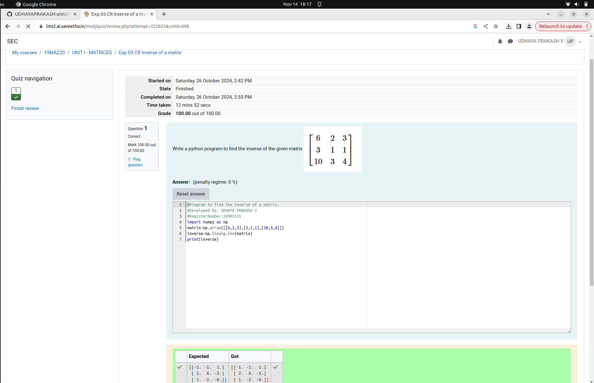

# INVERSE-OF-A-MATRIX
## Aim:
To write a python program to find the inverse of a matrix
## Equipment’s required:
1. 	Hardware – PCs
2. 	Anaconda – Python 3.7 Installation / Moodle-Code Runner
## Algorithm:
### Step1 :
import the numpy module to use the built-in-functions for calculation 
### Step 2:
prepare the lists from each linear equations and assign in np.array()
### Step 3: 
using the n.linalg.inv(), we can find the inverse of the given matrix
### Step 4:
End the program

## Program:
``````
#Program to find the inverse of a matrix.
#Developed by: UDHAYA PRAKASH V 
#RegisterNumber:24901131
import numpy as np
matrix=np.array([[6,2,3],[3,1,1],[10,3,4]])
inverse=np.linalg.inv(matrix)
print(inverse)
``````
## Output:
## Reslut
Thus the inverse of given matrix is successfully solved using python program

